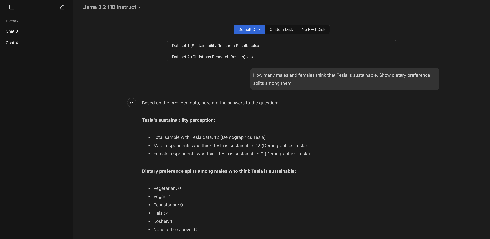

# AI Insights RAG

## Overview

This simple weekend project is a web app that to do Retrieal Augmented
Generation (RAG) on your data using AI. In simple terms, it performs search
within your documents using natural language queries. You will need LLM API keys
to deploy and use it.

Given the time, this app only showcases the art of the possible, bringing
together some standard libraries in a neat clean way. As such, a lot more needs
to be amended before it can be used in production. Expect to see bugs, hacks,
and workarounds!

The app is built with:

- Python FastAPI backend
- React frontend

## Screenshot



## Quick Start (Development)

Ready the data dir and update the .env file:

```
# cd data/default
# Optional: Place XSLS files in data/default dir
# cd -

cp .env.example .env
vim .env
# Update API keys and other config
```

Start the server:

```
docker compose up --build api
```

In another terminal, run parallelly:

```
cd deno
deno install
deno run dev

# vite will serve at localhost:5173
# it will automatically proxy API requests to localhost:8000
```

## How does it work?

- FastAPI backend serves requests on API endpoint at
  `localhost:8000/api/<routes>`.
- During development, React frontend is served by vite at `localhost:5173` which
  proxies API requests to backend.
- During production, the web app is built to `dist` dir and is served using
  NGINX on `localhost:80`, which proxies API requests to backend.
- This setup this run both the frontend and backend on the same host with no
  CORS issues.

For formating and linting:

- within `api`, ruff is used
- within `web`, deno is used

If you use VSCode, saves and pastes will trigger auto-formatting and linting.
But if you still want to run them manually, you can do so by running the
following commands:

```
# Within api dir
ruff check
ruff check --fix

# Within web dir
deno fmt src/
```

This setup (deno + ruff) conveniently avoids the need to install and configure
individual linters and formatters like Babel, TSConfig, ESLint, Prettier, flake,
black, etc. and keeps the file structure clean and easy to manage.

For now the data processing and retrieval is done using a simple Python script

- Excel files are read to a dataframe and converted to list of strings along
  with column headers
- Since the data correlation is both row and column based, the dataframe is
  transposed and converted to a list of strings
- Now the combined list of strings is passed to Sentence Transformers to get the
  embeddings
- When a user query arrives, the query is converted to embeddings and FAISS is
  used to find the nearest embeddings for context
- Then the context is passed to the LLM* to get insights
- The current implementation is reasonably* generalisable

*At the moment, the fact that the seed excel sheets contains first 2 rows as
headers is hard-coded. In addition, the start rows and columns is also
explicitly given

*Quality of insights is also dependent on the choice of LLM model used

### Features

- [x] Choice of AI model (on top left)
- [x] Conversation history (on the sidebar)
- [x] Choose between default, custom or no RAG disk
- [x] Seed XSLX files placed in default RAG disk
- [x] Chat interface with markdown support

TODOs:

- [ ] Process uploaded XSLX files to custom RAG disk
- [ ] User authentication
- [ ] Database for storing user data

## Deployment

### Start a VM

Tip: If you want Google's free tier, spin up a VM with the following
configuration:

1. Region: us-west1 or us-central1
2. Machine type: N1 Series, f1-micro (shared CPU)
3. Boot disk: 30 GB or less (Standard persistent disk)

### Install Docker

SSH into the VM and run the following commands:

```
# Install docker
sudo apt-get update
sudo apt-get install -y docker.io
sudo systemctl start docker
sudo systemctl enable docker
docker --version

# Install docker compose
sudo apt-get install -y docker-compose
docker-compose --version
```

### Pull source code

```
# Optional: Create a projects dir for better organization
mkdir -p ~/projects && cd ~/projects

git clone https://github.com/saravanabalagi/ai_insights_rag
cd ai_insights_rag
```

### Update .env file and seed data

```
cp .env.example .env
vim .env

# Update API keys and other config
# exit vim
```

You can place seed XSLX files in `data/default` dir, that will be loaded on
startup.

### Build and run the app

```
sudo docker-compose build
sudo docker-compose up -d
```

Expect the docker-compose build to take a while especially on f1-micro! Also
note that the memory that comes with f1-micro, ~512 MB is insufficient. Create
swap space of at least 1 GB and then run the build process. If necessary run
each pip install as a separate step in `api/Dockerfile` to take advantage of the
Docker layers, lest the process gets killed and you have to start over.

I would recommend running the build process in the background, inside tmux for
example. Once the build is complete, `up` shouldn't take much time. Take a nap
or grab a coffee. Or maybe even go to sleep, and check back next morning!
